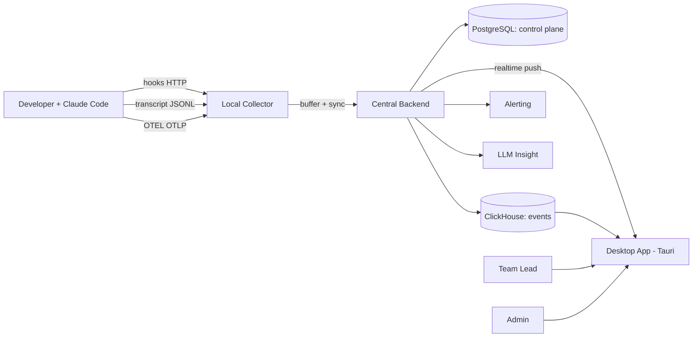
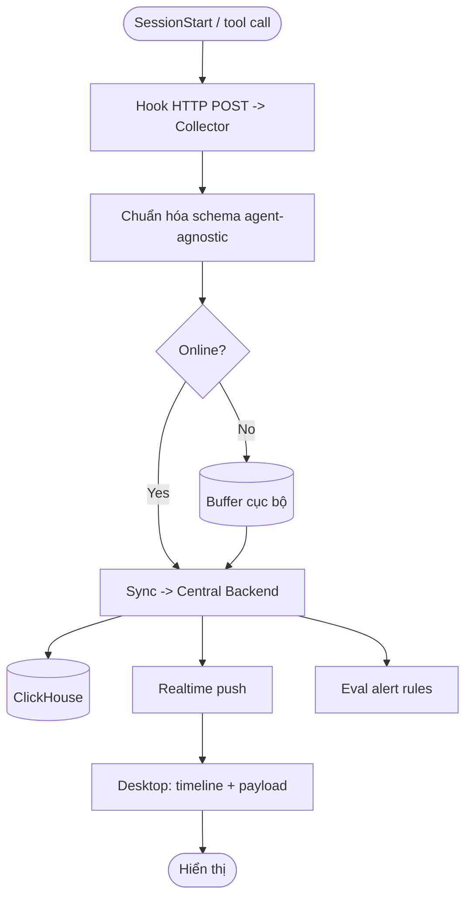
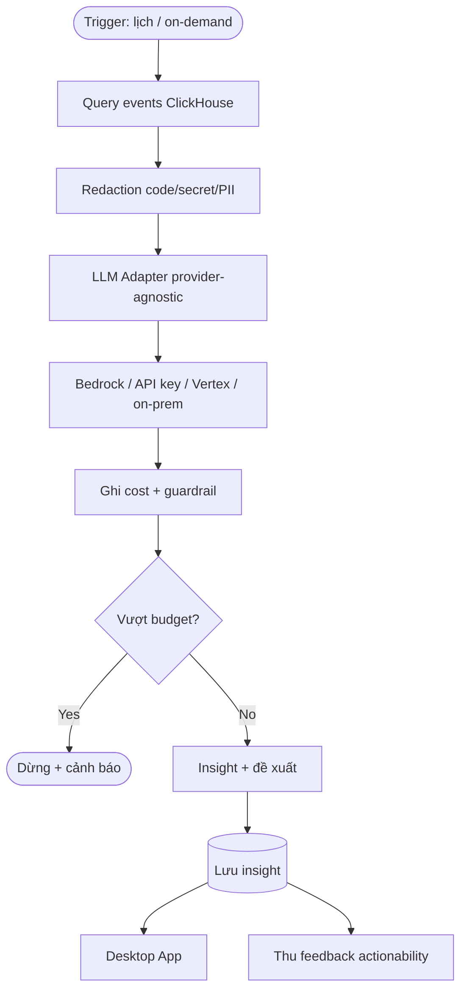
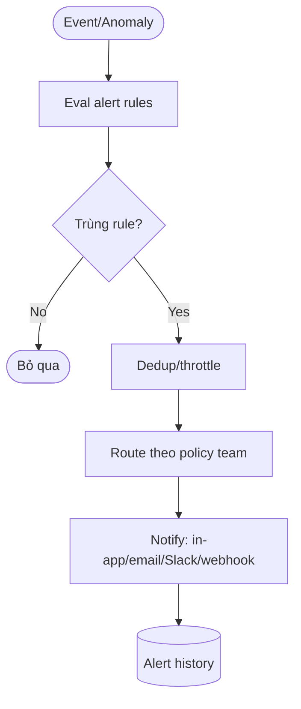

# PRD-0001: AgentLens — Hệ thống Quan sát & Phân tích Workflow Coding Agent

> **FIS analog:** SOD (Statement of Detail / Tài liệu Phân tích Luồng Nghiệp Vụ).
> Output của BA — input bắt buộc của SA.
> *"AgentLens" là codename đề xuất, có thể đổi.*
> **Bản v2: PRD full chức năng** — toàn bộ tính năng coi là in-scope; ưu tiên Must/Should/Could trong cùng phạm vi sản phẩm, không cắt theo MVP.

## Bảng ghi nhận thay đổi tài liệu

| Phiên bản | Ngày | Người sửa | Mô tả thay đổi | CR ID |
|---|---|---|---|---|
| 1.0 |  | BA | Initial draft từ 3 vòng brainstorm | - |
| 2.0 |  | BA | Chuyển sang full-scope: tổ chức 10 module, bổ sung reporting/alerting/settings/onboarding/API/data-mgmt/multi-agent | - |
| 3.0 |  | BA | M4 multi-provider: cấu hình nhiều LLM vendor (Anthropic/OpenAI/Gemini/GLM/MiniMax) để chạy phân tích | - |
| 4.0 | 2026-06-14 | SA | Chốt 8 quyết định (xem `DECISION-LOG.md`): backend Rust, redaction tại backend, giữ vendor TQ, default Anthropic, subscription chỉ cho dev (Non-Goal #3 làm rõ), retention 180 ngày, desktop-only, notify in-app/email/webhook | - |

## Trang ký

| Vai trò | Họ và tên | Chữ ký | Ngày |
|---|---|---|---|
| BA Author |  |  |  |
| SA Reviewer |  |  |  |
| QA Reviewer |  |  |  |
| PO/Sponsor |  |  |  |

---

## I. Tổng quan

### 1.1 Mục đích

Tài liệu mô tả yêu cầu cho một hệ thống **observability & analytics** đầy đủ chức năng cho coding agent — trước mắt là **Claude Code** — phục vụ toàn org. Hệ thống cho phép xem agent đang làm gì (tool/hook), agent "nghĩ gì" (reasoning), thống kê token/cost/latency tập trung, cảnh báo, báo cáo, và phân tích bằng LLM để cải thiện workflow dần theo thời gian. Tài liệu là input cho SA (TRD) và DEV; đối tượng đọc: SA, DEV, QA, PO, Platform/DevEx admin.

### 1.2 Phạm vi

Hệ thống mới (greenfield), **full chức năng**, tổ chức theo 10 module (M1–M10). MVP-defining nhưng không cắt scope: tất cả module thuộc phạm vi sản phẩm. Hỗ trợ **Claude Code** đầy đủ; data model **agent-agnostic** với adapter **Codex/Antigravity** trong phạm vi. Triển khai **org-wide** (multi-user, central backend, RBAC).

### 1.3 Thuật ngữ và từ viết tắt

| Thuật ngữ | Định nghĩa |
|---|---|
| Hook | Cơ chế Claude Code fire event tại điểm lifecycle, đẩy JSON cho handler qua stdin (command) hoặc POST (HTTP) |
| Transcript JSONL | File hội thoại session Claude Code (`~/.claude/projects/<proj>/<session>.jsonl`) — message, tool call/result, thinking, usage |
| OTEL | OpenTelemetry — telemetry opt-in của Claude Code (metrics + events qua OTLP) |
| Session | Một phiên làm việc của agent (1 session_id) |
| prompt.id | ID gom mọi event của một prompt (user_prompt → api_request → tool_result) |
| Module (M1–M10) | Nhóm chức năng của sản phẩm |
| RBAC | Role-Based Access Control |
| Bedrock | Amazon Bedrock (chạy Claude qua VPC, cost tập trung) |
| ClickHouse | Columnar DB cho analytics time-series |
| FinOps | Quản trị chi phí (cost attribution, budget) |
| LLM Gateway | Lớp trừu tượng gọi nhiều LLM vendor qua một interface thống nhất |
| GLM | Mô hình của Zhipu AI (智谱), Trung Quốc |
| MiniMax | Mô hình của MiniMax, Trung Quốc |

### 1.4 Tài liệu tham chiếu

| Mã | Tên tài liệu | Phiên bản |
|---|---|---|
| REF-1 | Claude Code Hooks reference (code.claude.com/docs/en/hooks) | 2026-04 |
| REF-2 | Claude Code Monitoring/OpenTelemetry (code.claude.com/docs/en/monitoring-usage) | 2026-04 |
| REF-3 | Claude Code usage limits & Agent SDK credit (subscription) | 2026-05 |
| REF-4 | Brainstorm sessions (turn 1: multi-agent SDD; turn 2: subscription limits) | nội bộ |

---

## II. Vấn đề và mục tiêu

### 2.1 Problem statement

**Vấn đề hiện tại:**
- Ở quy mô org, team **không quan sát được** agent đang làm gì (tool/hook nào), "nghĩ gì", tốn bao nhiêu token/cost, ở đâu chậm/lỗi.
- Không có dữ liệu lịch sử tập trung, không cảnh báo, không báo cáo → tối ưu workflow/prompt/skill/hook là **làm mò**.

**Tại sao cần giải quyết bây giờ:**
- Coding agent đã thành công cụ hằng ngày; chi phí & chất lượng phụ thuộc trực tiếp vào workflow. Thiếu observability = không thể cải thiện có hệ thống.

**Ai bị ảnh hưởng:**
- Developer dùng agent; Team Lead / Architect (tối ưu workflow & cost); Org (governance, FinOps, security).

### 2.2 Goals

1. Quan sát **realtime**: agent đang làm gì, dùng tool/hook nào, đang nghĩ gì.
2. Lưu trữ & thống kê **tập trung, org-wide**, theo thời gian, có **báo cáo & cảnh báo**.
3. **Phân tích (LLM)** → đề xuất cải thiện workflow tốt dần.
4. Kiến trúc **agent-agnostic** đầy đủ (CC + Codex + Antigravity).
5. **Zero-token cho việc quan sát** (M1–M3 không phát sinh token); chi phí token chỉ ở M4 (LLM).

### 2.3 Non-Goals (cố ý không làm)

1. KHÔNG điều khiển/chặn agent — chỉ quan sát (gating/policy là việc của hooks gốc).
2. KHÔNG thay thế SIEM/OTEL backend hiện có của org — bổ sung & tích hợp, không thay.
3. KHÔNG dùng subscription cá nhân cho LLM phân tích **org-wide** (ToS + quota) — org-wide đi qua API key/Bedrock. *Cho phép* dùng subscription ở **phạm vi dev** (dev tự phân tích session của mình). (Chốt D-05, `DECISION-LOG.md`.)
4. KHÔNG benchmark/so sánh chất lượng giữa các agent (chạy 1 spec qua nhiều agent) — khác với so sánh metric vận hành (M3).
5. KHÔNG hỗ trợ IDE-agent không expose hook/telemetry.

### 2.4 Success metrics (KPI)

> [Inference] Target dưới đây là đề xuất, cần PO/Lead chốt.

| KPI | Baseline | Target | Đo bằng |
|---|---|---|---|
| Session coverage | 0% | >95% | tỉ lệ session có trong store |
| Độ trễ "session → thấy activity/cost" | thủ công | <1 phút | latency ingest |
| Giảm token/task sau 1 quý | baseline đo được | -15% [Inference] | trend ClickHouse |
| Giảm tool-error / permission-deny | chưa đo | -20% [Inference] | event analytics |
| Mean-time-to-detect (alert) | n/a | <5 phút | thời gian từ sự cố → alert |
| Adoption | 0 | TODO (Lead điền) | active users/tuần |
| LLM insight actionability | n/a | theo dõi | % đề xuất được áp dụng (FR-26) |

---

## III. Danh sách yêu cầu (full chức năng — tổ chức theo module)

> Ưu tiên: Must / Should / Could. Tất cả thuộc phạm vi sản phẩm; không phase-out.

### 3.1 Yêu cầu trong phạm vi

**M1 — Collection (thu thập)**

| ID | Yêu cầu | Ưu tiên |
|---|---|---|
| FR-1 | Nhận hook events realtime qua HTTP (Pre/PostToolUse, UserPromptSubmit, Stop, SubagentStart/Stop, Notification, PermissionRequest, SessionStart/End, PreCompact) | Must |
| FR-2 | Parse & ingest transcript JSONL: message, tool call/result, **thinking**, `usage` (token) | Must |
| FR-3 | Ingest OTEL metrics & events (token.usage, cost.usage có agent.name/skill.name, tool latency, LOC, commits) | Must |
| FR-4 | Local collector chạy nền trên máy dev: buffer offline + sync central | Must |
| FR-5 | Chuẩn hóa event về schema **agent-agnostic** (`agent_type`) | Must |
| FR-6 | Ingest idempotent, dedup, ordering theo `prompt.id` | Must |

**M2 — Realtime Monitoring**

| ID | Yêu cầu | Ưu tiên |
|---|---|---|
| FR-7 | Timeline session realtime gom theo `prompt.id` | Must |
| FR-8 | Live view "agent đang làm gì" (tool đang chạy, trạng thái turn) | Must |
| FR-9 | Xem chi tiết payload: tool_input / tool_response / **thinking** | Must |
| FR-10 | Session replay (tua lại theo timeline như debugger) | Should |
| FR-11 | Theo dõi nhiều session/dev cùng lúc (multi-session live) | Should |

**M3 — Analytics & Reporting**

| ID | Yêu cầu | Ưu tiên |
|---|---|---|
| FR-12 | Dashboard token/cost theo skill·agent·dev·project | Must |
| FR-13 | Tool-latency percentile, permission-deny rate, hook-fail rate | Must |
| FR-14 | Trends theo thời gian (cải thiện workflow) | Must |
| FR-15 | Filter/search đa chiều (dev·project·session·tool·time) | Must |
| FR-16 | So sánh dev·team·project·khoảng thời gian | Should |
| FR-17 | Breakdown theo skill.name, hook, subagent (Task) | Should |
| FR-18 | Export báo cáo (PDF/CSV/Excel) + scheduled report | Should |
| FR-19 | Cost attribution & FinOps (budget per team/project) | Should |
| FR-20 | Session annotation/tagging (task type, success/fail) | Could |

**M4 — LLM Insight (multi-provider)**

| ID | Yêu cầu | Ưu tiên |
|---|---|---|
| FR-21 | Tóm tắt session bằng LLM | Must |
| FR-22 | Đề xuất cải thiện workflow/prompt/skill/hook từ data lịch sử | Must |
| FR-23 | Redaction code/secret/PII trước khi gửi LLM | Must |
| FR-24 | **LLM Gateway provider-agnostic** — cấu hình & chạy phân tích qua nhiều vendor: Anthropic (Claude/Bedrock/Vertex), OpenAI (ChatGPT), Google (Gemini), Zhipu (GLM), MiniMax; mỗi provider có endpoint/API key/model/region riêng | Must |
| FR-25 | Cost guardrail + budget cho LLM (chặn khi vượt) | Must |
| FR-26 | Insight feedback (đã áp dụng/bỏ qua → đo actionability) | Should |
| FR-27 | Anomaly detection (latency/cost/error bất thường) | Should |
| FR-48 | Chọn provider/model: mặc định toàn hệ thống + override per-job; fallback khi provider lỗi/hết quota | Must |
| FR-49 | Cost & quota tracking **per-provider** (so sánh chi phí giữa vendor; budget riêng từng provider) | Should |
| FR-50 | Provider policy: chặn/cho phép vendor theo project nhạy cảm (vd cấm gửi data project gov ra vendor ngoài) | Should |

**M5 — Alerting & Notification**

| ID | Yêu cầu | Ưu tiên |
|---|---|---|
| FR-28 | Rule-based alert (budget vượt, tool-fail spike, latency/cost anomaly, permission-deny bất thường) | Must |
| FR-29 | Kênh notify: in-app, email, Slack/Teams, webhook | Should |
| FR-30 | Alert policy quản lý theo team/project | Should |

**M6 — Admin, RBAC & Settings**

| ID | Yêu cầu | Ưu tiên |
|---|---|---|
| FR-31 | Auth (SSO/OIDC) + RBAC (dev/lead/admin/security) | Must |
| FR-32 | Settings UI: endpoint, LLM provider, retention, redaction rules | Must |
| FR-33 | Audit log (ai xem/đổi gì) | Must |
| FR-34 | Quản lý org / team / project | Should |

**M7 — Onboarding & Collector Management**

| ID | Yêu cầu | Ưu tiên |
|---|---|---|
| FR-35 | Onboarding wizard (cài collector, cấu hình hook/OTEL trên máy dev) | Should |
| FR-36 | Quản lý collector: health, version, ingest lag, dropped events | Should |
| FR-37 | Phân phối cấu hình tập trung (managed-settings.json/MDM) | Should |

**M8 — Integration (API / Webhook)**

| ID | Yêu cầu | Ưu tiên |
|---|---|---|
| FR-38 | REST API đọc metrics/events/insight (tích hợp CI, harness CLI) | Should |
| FR-39 | Webhook outbound khi có alert/insight | Should |
| FR-40 | Tích hợp/forward sang ELK/OTEL backend hiện có (dual-write) | Could |

**M9 — Data Management & Retention**

| ID | Yêu cầu | Ưu tiên |
|---|---|---|
| FR-41 | Retention policy cấu hình + auto-purge | Must |
| FR-42 | Export/backup dữ liệu | Should |
| FR-43 | Xóa theo user/project (privacy/compliance) | Should |

**M10 — Multi-agent Adapters**

| ID | Yêu cầu | Ưu tiên |
|---|---|---|
| FR-44 | Adapter interface chuẩn (contract chung) | Must |
| FR-45 | Adapter **Claude Code** (đầy đủ) | Must |
| FR-46 | Adapter **Codex** | Should |
| FR-47 | Adapter **Antigravity** | Should |

### 3.2 Yêu cầu ngoài phạm vi

| ID | Yêu cầu | Lý do out-of-scope |
|---|---|---|
| OOS-1 | Điều khiển/gating agent | Đã có hooks gốc; tránh trùng & rủi ro |
| OOS-2 | Benchmark chất lượng đa agent (1 spec → nhiều agent) | Khác mục tiêu observability |
| OOS-3 | Thay thế SIEM/OTEL backend org | Bổ sung & tích hợp, không thay |
| OOS-4 | Hỗ trợ IDE-agent không expose telemetry | Thiếu data source |

### 3.3 Non-Functional Requirements

| NFR | Target | Đo bằng |
|---|---|---|
| Performance | Ingest <1s/event; dashboard query <2s ở ≥10M event | latency/load test |
| Security | Redaction; SSO+RBAC; encrypt in-transit & at-rest; audit log | review + pentest |
| Scalability | Org-wide; ClickHouse scale ngang; hàng chục triệu event/tháng | load test |
| Availability | Backend ≥99.5%; collector buffer khi mất mạng | uptime monitor |
| Compatibility | Desktop cross-platform (Win/macOS/Linux) qua Tauri; Claude Code v2.1.x+ (HTTP hook; `defer` v2.1.89+) | test ma trận |
| Self-observability | Hệ thống tự giám sát ingest lag, dropped events, LLM cost | dashboard nội bộ |
| Privacy/Compliance | Opt-in telemetry; gửi tối thiểu cho LLM; tuân ToS | review |
| Maintainability | Adapter versioned, tách core; test theo mỗi release agent | code review |
| i18n | UI VN/EN | review |

---

## IV. Đối tượng sử dụng hệ thống

> Reference: `artifacts/personas/PERSONAS.md` (chưa tạo)

### 4.1 Định nghĩa đối tượng

| Vai trò | Mô tả | Số lượng | Tần suất |
|---|---|---|---|
| Developer | Dùng agent, xem session của mình realtime, replay | Nhiều | Hằng ngày |
| Team Lead / Architect | Analytics team/org, báo cáo, tối ưu workflow & cost | Vài | Hằng tuần |
| Platform/DevEx Admin | Cấu hình, RBAC, vận hành backend, onboard dev | Ít | Định kỳ |
| Security / FinOps | Audit cost, compliance, redaction, budget | Ít | Định kỳ |

### 4.2 Tổng quan quy trình và đối tượng tham gia

---

## V. Quy trình nghiệp vụ

### 5.1 Quy trình thu thập & hiển thị realtime

#### 5.1.1 Yêu cầu
**Mục đích:** Thu mọi hoạt động agent trong session, hiển thị realtime, không phát sinh token.
**Yêu cầu chung:** Hooks HTTP + JSONL tailer + OTEL; chuẩn hóa schema; push realtime.

#### 5.1.2 Sự kiện kích hoạt
Dev khởi động session Claude Code (SessionStart) và mỗi tool call / prompt / stop.

#### 5.1.3 Sự kiện tiếp theo
Event lưu central (ClickHouse) + push realtime lên desktop; cập nhật metrics; kiểm tra alert.

#### 5.1.4 Sơ đồ luồng nghiệp vụ

#### 5.1.5 Mô tả các bước

| STT | Bước | Actor | Mô tả | Đầu vào | Đầu ra | Validation |
|---|---|---|---|---|---|---|
| 1 | Fire hook | Claude Code | POST event JSON tới collector | event lifecycle | JSON payload | schema hợp lệ |
| 2 | Chuẩn hóa | Collector | Map schema chung (agent_type, session_id, prompt.id) | payload thô | event chuẩn | bắt buộc trường |
| 3 | Buffer/Sync | Collector | Online→sync, offline→buffer | event chuẩn | ghi central | retry idempotent |
| 4 | Lưu + push | Backend | Ghi ClickHouse + push realtime + eval alert | event chuẩn | row + WS + alert | ack |
| 5 | Hiển thị | Desktop | Timeline theo prompt.id + chi tiết | stream | UI realtime | render <1s |

### 5.2 Quy trình phân tích workflow & sinh insight (LLM)

#### 5.2.1 Yêu cầu
**Mục đích:** Từ data lịch sử, sinh tóm tắt + đề xuất cải thiện workflow.
**Yêu cầu chung:** Redaction trước khi gửi; adapter provider-agnostic; ghi & giới hạn cost.

#### 5.2.2 Sự kiện kích hoạt
Theo lịch (ngoài giờ) hoặc on-demand (Lead bấm "Phân tích").

#### 5.2.3 Sự kiện tiếp theo
Insight lưu + hiển thị; cost ghi vào guardrail; có thể sinh alert.

#### 5.2.4 Sơ đồ luồng nghiệp vụ

#### 5.2.5 Mô tả các bước

| STT | Bước | Actor | Mô tả | Đầu vào | Đầu ra | Validation |
|---|---|---|---|---|---|---|
| 1 | Trigger | Lead/Scheduler | Khởi tạo phân tích | range/scope | job | quyền RBAC |
| 2 | Query | Backend | Lấy event theo scope | filter | tập event | giới hạn size |
| 3 | Redaction | Backend | Lọc code/secret/PII | event thô | event sạch | rule coverage |
| 4 | Gọi LLM | Adapter | Gửi qua provider cấu hình | prompt + data | insight | timeout/retry |
| 5 | Guardrail | Backend | Cộng dồn cost, chặn nếu vượt | usage | pass/stop | budget |
| 6 | Lưu & hiển thị | Backend/App | Lưu insight + render + feedback | insight | UI | - |

### 5.3 Quy trình cảnh báo (Alerting)

#### 5.3.1 Yêu cầu
**Mục đích:** Phát hiện sớm bất thường (budget, tool-fail, latency/cost anomaly) và thông báo đúng người.
**Yêu cầu chung:** Rule engine + nhiều kênh notify + policy theo team.

#### 5.3.2 Sự kiện kích hoạt
Mỗi batch event ingest, hoặc kết quả anomaly detection (FR-27).

#### 5.3.3 Sự kiện tiếp theo
Gửi notify (in-app/email/Slack/webhook); ghi vào alert history.

#### 5.3.4 Sơ đồ luồng nghiệp vụ

#### 5.3.5 Mô tả các bước

| STT | Bước | Actor | Mô tả | Đầu vào | Đầu ra | Validation |
|---|---|---|---|---|---|---|
| 1 | Eval | Backend | So event với rule | event | match? | rule hợp lệ |
| 2 | Dedup | Backend | Gộp/giảm nhiễu | match | alert | throttle window |
| 3 | Route+Notify | Backend | Gửi đúng kênh/người | alert + policy | thông báo | delivery ack |

### 5.4 Quy trình onboard máy dev & quản lý collector

**Mục đích:** Cài & cấu hình collector + hook/OTEL trên máy dev; theo dõi health collector.
**Trigger:** Dev mới / cập nhật cấu hình tập trung.
**Next:** Collector báo health về backend; sẵn sàng thu event.
*(Step detail: SA chi tiết hoá ở TRD — wizard + managed-settings.json/MDM.)*

### 5.5 Quy trình quản trị (RBAC, settings, retention)

**Mục đích:** Quản lý user/role, cấu hình hệ thống (LLM provider, redaction, retention), audit.
**Trigger:** Admin thao tác.
**Next:** Cấu hình áp dụng; ghi audit log.
*(Step detail: SA chi tiết hoá ở TRD.)*

---

## VI. User stories (high-level)

- Là **Developer**, tôi muốn xem realtime agent đang chạy tool/hook nào để biết nó đang làm gì.
- Là **Developer**, tôi muốn xem agent "nghĩ gì" (thinking) và tua lại session để hiểu quyết định.
- Là **Team Lead**, tôi muốn dashboard + báo cáo token/cost theo dev·project để tối ưu chi phí.
- Là **Team Lead**, tôi muốn nhận đề xuất cải thiện workflow từ phân tích lịch sử.
- Là **Team Lead**, tôi muốn được cảnh báo khi cost vượt ngân sách hoặc tool-fail tăng bất thường.
- Là **Admin**, tôi muốn SSO + RBAC để dev chỉ xem dữ liệu của mình, và cấu hình LLM/redaction/retention.
- Là **DevEx Admin**, tôi muốn onboarding wizard để triển khai collector toàn org dễ dàng.
- Là **Architect**, tôi muốn API + kiến trúc agent-agnostic để tích hợp harness và thêm Codex/Antigravity.

---

## VII. Constraints, assumptions, dependencies

### 7.1 Constraints
- Tech stack: Desktop **Tauri** (Rust core + web UI); backend **PostgreSQL** (control plane) + **ClickHouse** (event analytics); **LLM Gateway multi-provider** (Anthropic/Bedrock/Vertex, OpenAI, Gemini, GLM, MiniMax), mặc định Claude.
- **M1–M3 zero-token**; **M4 (LLM)** gọi vendor ngoài (Anthropic/OpenAI/Gemini/GLM/MiniMax) — chi phí token thật theo từng vendor, KHÔNG subscription org.
- Cloud công cộng OK — redaction vẫn áp dụng như best practice.
- Timeline linh hoạt → ưu tiên Must→Should→Could trong cùng phạm vi (không cắt scope).
- Hooks chỉ fire trong session Claude Code → bắt buộc local collector trên mỗi máy dev.

### 7.2 Assumptions
- Dev bật hooks + OTEL (qua onboard/`managed-settings.json`).
- [Unverified] Thinking blocks nằm đầy đủ trong transcript JSONL — **cần verify theo version Claude Code** (Open questions).
- Org có AWS Bedrock (hoặc chấp nhận API key Console).
- Volume event ở mức ClickHouse xử lý tốt.

### 7.3 Out-of-scope dependencies
- Claude Code v2.1.x+ (HTTP hooks; `defer` v2.1.89+).
- AWS Bedrock / Anthropic Console (M4).
- Hạ tầng deploy backend (container/k8s) + ClickHouse + PostgreSQL.
- IdP cho SSO/OIDC; kênh notify (SMTP/Slack/Teams).

---

## VIII. Risks

| Risk | Likelihood | Impact | Mitigation | Owner |
|---|---|---|---|---|
| Full-scope → timeline/resourcing căng | H | M | Ưu tiên Must trước trong cùng release; resourcing rõ; không cắt scope nhưng giãn Should/Could | PO/Lead |
| M4 (LLM) cost vượt ngân sách | M | H | Cost guardrail (FR-25); batch ngoài giờ; budget/team | Lead |
| [Unverified] Thinking không đầy đủ trong JSONL theo version | M | M | Verify sớm; fallback chỉ tool/metrics nếu thiếu | SA |
| Onboard hook trên nhiều máy dev khó đồng bộ | M | M | managed-settings.json/MDM; installer collector | Admin |
| Code nhạy cảm lọt vào LLM/cloud | M | H | Redaction bắt buộc (FR-23); audit; VPC | Security |
| Gửi data ra vendor LLM ngoài (đặc biệt GLM/MiniMax — TQ) → data residency/chủ quyền | M | H | Redaction (FR-23); provider policy (FR-50) cấm vendor cho project gov; chọn default theo compliance | Security |
| Claude Code đổi schema hook/telemetry | M | M | Adapter versioned; test theo mỗi release | DEV |
| Lock-in agent/LLM | L | M | Agent-agnostic (FR-5/44) + provider-agnostic (FR-24) | SA |
| Alert noise (quá nhiều cảnh báo) | M | M | Dedup/throttle; policy theo team (FR-30) | Lead |

---

## IX. Open questions

- [Unverified] Thinking blocks lưu đầy đủ raw trong JSONL hay rút gọn theo version Claude Code? → verify thực nghiệm trước khi build M2 (FR-9).
- LLM default: **Bedrock** hay **API key Console**? (cloud OK → cả hai khả thi; chốt theo cost & RBAC).
- Local collector: **service nền** hay tích hợp desktop app? ([Inference] org-wide → nên service nền để thu kể cả khi app đóng).
- **Retention** event: 90 ngày? 1 năm? (ảnh hưởng cost ClickHouse — FR-41).
- **KPI target** cụ thể (giảm token %, adoption) — PO/Lead điền.
- Cần thêm **web dashboard read-only** cho Lead bên cạnh desktop không? (desktop đã chọn; cân nhắc bổ sung).
- Kênh notify ưu tiên (Slack/Teams/email)? (FR-29).
- LLM provider mặc định cho phân tích (Claude/OpenAI/Gemini/GLM/MiniMax)? tiêu chí chọn (chất lượng vs cost)?
- [Inference] Chính sách vendor cho data nhạy cảm: có cho phép gửi ra vendor TQ (GLM/MiniMax) không? Với context gov, nên cân nhắc cấm hoặc chỉ dùng cho project không nhạy cảm.

---

## X. Phụ lục

- **Data sources** (REF-1/2/3): hooks (HTTP, realtime) · transcript JSONL · OpenTelemetry (`prompt.id` correlation).
- **Kiến trúc 3 tầng → 10 module:** Collection (M1) → Realtime (M2) + Analytics/Reporting (M3) → LLM Insight (M4); cộng Alerting (M5), Admin/RBAC/Settings (M6), Onboarding (M7), Integration (M8), Data mgmt (M9), Multi-agent adapters (M10).
- **Module map ưu tiên** [Inference]: Must (M1, M2 lõi, M3 lõi, M4 lõi, M6 auth/RBAC, M9 retention) là xương sống; Should/Could (replay, comparison, export, alerting kênh ngoài, onboarding wizard, API, adapter Codex/Antigravity) giãn theo resourcing — **trong cùng phạm vi sản phẩm, không cắt**.

---

## Validation notes (advisory — tùy chọn)

| Lăng kính | Nhận xét | Ngày |
|---|---|---|
| BA (scope/value) | Full-scope, value cao. **Lưu ý:** timeline/resourcing là rủi ro chính — ưu tiên Must trước, không cắt scope | - |
| SA (feasibility) | Khả thi với hooks/JSONL/OTEL. Verify thinking-in-JSONL; thiết kế collector (service nền) + rule engine alert | - |
| QA (testability) | Định nghĩa rõ "coverage %"; load test ClickHouse ≥10M event; test redaction coverage; test alert dedup | - |
