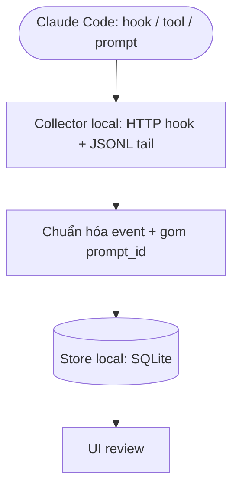

# PRD-0001: AgentLens — Theo dõi & Review session Claude Code (Lean)

> **Mục đích thật:** ghi lại các session Claude Code (hook, thinking, prompt, cost) để **review sau** và rút ra cải tiến workflow.
> **Lean scope (v5):** chạy **local** cho cá nhân / 1 team nhỏ. Không backend tập trung, không RBAC, không gateway đa vendor, không alerting, không multi-agent. Các tính năng đó nằm ở "full vision" (xem `module-list.md`, `feature-catalog.md` — đã hoãn).

## Bảng ghi nhận thay đổi tài liệu

| Phiên bản | Ngày | Người sửa | Mô tả thay đổi |
|---|---|---|---|
| 1.0–3.0 |  | BA | (lịch sử) draft → full-scope 10 module → multi-provider |
| 4.0 | 2026-06-14 | SA | Chốt 8 quyết định (DECISION-LOG) |
| **5.0** | **2026-06-14** | **BA/SA** | **LEAN: thu về Capture/Store/Review, local-first cho cá nhân/team nhỏ; hoãn toàn bộ phần org-wide** |

---

## I. Tổng quan

### 1.1 Mục đích
Một công cụ **local** ghi lại hoạt động của **Claude Code** trong mỗi session — hook (tool/prompt/stop), **thinking**, prompt, và **token/cost** — lưu lại để **xem lại (review)** và dần rút ra cải tiến workflow/prompt/skill/hook.

### 1.2 Phạm vi
- **In:** thu thập (hook + transcript JSONL) → lưu local → UI review (timeline + cost). Chỉ **Claude Code**. Một người hoặc một team nhỏ tự host trên máy mình.
- **Out (hoãn — "full vision"):** backend tập trung org-wide; RBAC/SSO; LLM gateway đa vendor + vendor TQ; alerting/notification; REST API/webhook; onboarding wizard/MDM; FinOps budget/anomaly; multi-agent adapter (Codex/Antigravity).

### 1.3 Thuật ngữ
| Thuật ngữ | Định nghĩa |
|---|---|
| Hook | Claude Code fire event tại lifecycle, POST JSON tới handler (HTTP) |
| Transcript JSONL | File session `~/.claude/projects/<proj>/<session>.jsonl` — message, tool call/result, thinking, usage |
| Session / prompt.id | 1 phiên (session_id); prompt.id gom event của một lượt prompt |
| OTEL | OpenTelemetry — tùy chọn, chỉ dùng để lấy cost chuẩn (về sau) |

### 1.4 Tham chiếu
| Mã | Tài liệu | Phiên bản |
|---|---|---|
| REF-1 | Claude Code Hooks (code.claude.com/docs/en/hooks) | 2026-04 |
| REF-2 | Claude Code Monitoring/OpenTelemetry | 2026-04 |

---

## II. Vấn đề & mục tiêu

**Vấn đề:** Claude Code là "hộp đen" — không xem lại được nó đã chạy tool/hook nào, nghĩ gì, tốn bao nhiêu token ở đâu → tối ưu workflow là làm mò.

**Goals:**
1. Bắt **đủ** hoạt động mỗi session (hook + thinking + prompt + usage) với **zero-token** (chỉ đọc dữ liệu Claude Code đã sinh).
2. **Lưu local** để truy vấn lại theo session/ngày/skill.
3. **Review**: timeline session + bảng token/cost → tự rút cải tiến.
4. (Sau) **LLM tóm tắt + gợi ý** cải thiện workflow — tùy chọn, 1 provider.

**Non-goals:** điều khiển/chặn agent; org-wide multi-user; thay SIEM; benchmark đa agent.

---

## III. Yêu cầu chức năng

**Capture**
| ID | Yêu cầu | Ưu tiên |
|---|---|---|
| FR-1 | Nhận hook HTTP local: SessionStart/End, UserPromptSubmit, Pre/PostToolUse, Stop, SubagentStop | Must |
| FR-2 | Tail transcript JSONL: prompt, **thinking**, tool_input/response, `usage` (token) | Must |
| FR-3 | Chuẩn hóa + lưu local, gom theo session_id / prompt_id, idempotent khi tail lại | Must |
| FR-4 | (Tùy chọn) Ingest OTEL để lấy cost chuẩn | Could |

**Review**
| ID | Yêu cầu | Ưu tiên |
|---|---|---|
| FR-5 | Timeline 1 session: prompt → tool → thinking → stop | Must |
| FR-6 | Bảng token/cost theo session / ngày / skill / tool | Must |
| FR-7 | Filter/search session (theo project, thời gian, tool) | Should |
| FR-8 | LLM tóm tắt session + gợi ý cải thiện workflow (1 provider, redact secret trước khi gửi) | Should |

**Data**
| ID | Yêu cầu | Ưu tiên |
|---|---|---|
| FR-9 | Retention đơn giản: giữ N ngày, tự xóa cũ (mặc định 180) | Could |
| FR-10 | Xóa session theo tay | Could |

### NFR (nhẹ)
- Hook trả về nhanh (<200ms) để không chặn agent; xử lý async.
- Chạy cross-platform (Win/macOS/Linux).
- Dữ liệu ở local máy dev; nếu dùng FR-8 thì redact secret/key trước khi gửi LLM.

---

## IV. Người dùng
- **Developer** (chính): xem lại session của mình, tự cải thiện workflow.
- **Team nhỏ** (tùy chọn): chia sẻ store/cấu hình chung, không cần phân quyền.

---

## V. Luồng nghiệp vụ

### 5.1 Thu thập (realtime, zero-token)

### 5.2 Review & cải tiến
Dev mở UI → chọn session/khoảng thời gian → xem timeline + thinking + cost → (tùy chọn) bấm "Tóm tắt/Gợi ý" để LLM phân tích → rút cải tiến workflow.

---

## VI. Open questions
- `[Unverified]` Thinking lưu **đầy đủ raw** trong JSONL hay rút gọn theo version Claude Code? → verify thực nghiệm trước khi làm FR-5/thinking.
- Có cần FR-8 (LLM gợi ý) ngay từ đầu, hay review thủ công trước rồi thêm sau?
