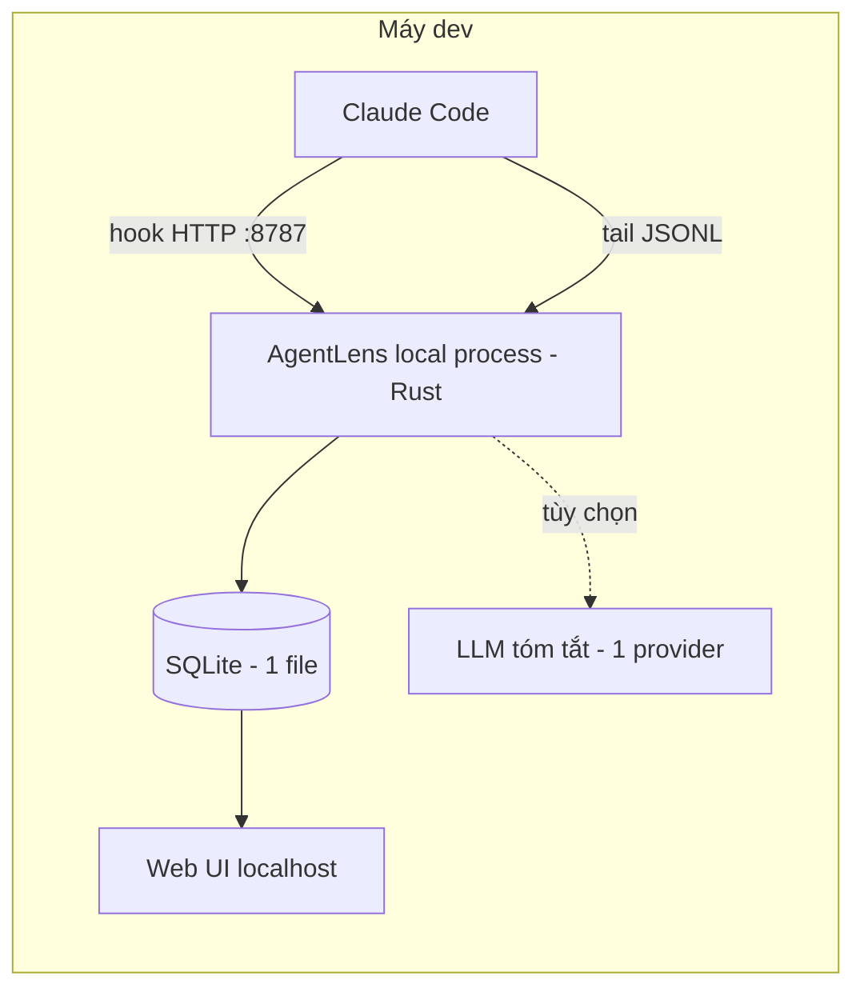

# TRD-0001: AgentLens — Technical Design (Lean)

> Cặp với **PRD-0001 v5** (lean). Thiết kế cho 1 process **local** trên máy dev: bắt session Claude Code → lưu store nhúng → UI review. Sự kiện Claude Code (hook/JSONL/OTEL) là `[Verified]` theo REF-1/2; quyết định kỹ thuật gắn `[Inference]`.

---

## 1. Phạm vi
Một công cụ local cho cá nhân / team nhỏ. **Không** backend tập trung, **không** RBAC/SSO, **không** gateway đa vendor, **không** alerting. 3 việc: **Capture → Store → Review** (+ LLM tóm tắt tùy chọn).

## 2. Kiến trúc



**Nguyên tắc:** 1 binary chạy nền trên máy dev, thụ động & zero-token (chỉ đọc dữ liệu Claude Code đã sinh). UI phục vụ ngay trên localhost từ chính binary đó.

## 3. Tech stack

| Lớp | Lựa chọn | Ghi chú |
|---|---|---|
| Collector + API + UI server | **Rust (axum + tokio)** | 1 binary; nhận hook, tail JSONL, serve UI |
| Store | **SQLite (embedded, 1 file)** | đơn giản, ubiquitous; đủ cho cá nhân/team nhỏ. Cost/token tổng hợp bằng SQL aggregate + index |
| UI | **Web nhẹ** (HTML/JS) phục vụ trên `localhost` | dùng chung cho cả 2 chế độ chạy |
| Desktop | **Tauri 2** bọc server lõi (D-14) | crate lõi = lib+bin; app chạy `agentlens::run()` trong thread, cửa sổ trỏ `http://127.0.0.1:8787` (cùng origin → không CORS). Linux cần webkit2gtk-4.1 |
| LLM (FR-8, tùy chọn) | 1 provider (Anthropic) qua API key | redact secret trước khi gửi; không cần gateway đa vendor |

## 4. Nguồn dữ liệu Claude Code

### 4.1 Hooks — HTTP local `[Verified]`
`.claude/settings.json` trỏ về collector local:
```json
{
  "hooks": {
    "SessionStart":     [{ "matcher": "*", "hooks": [{ "type": "http", "url": "http://127.0.0.1:8787/hook", "timeout": 5 }] }],
    "UserPromptSubmit": [{ "matcher": "*", "hooks": [{ "type": "http", "url": "http://127.0.0.1:8787/hook", "timeout": 5 }] }],
    "PreToolUse":       [{ "matcher": "*", "hooks": [{ "type": "http", "url": "http://127.0.0.1:8787/hook", "timeout": 5 }] }],
    "PostToolUse":      [{ "matcher": "*", "hooks": [{ "type": "http", "url": "http://127.0.0.1:8787/hook", "timeout": 5 }] }],
    "Stop":             [{ "matcher": "*", "hooks": [{ "type": "http", "url": "http://127.0.0.1:8787/hook", "timeout": 5 }] }],
    "SessionEnd":       [{ "matcher": "*", "hooks": [{ "type": "http", "url": "http://127.0.0.1:8787/hook", "timeout": 5 }] }]
  }
}
```
- Payload có: `hook_event_name`, `session_id`, `cwd`, `transcript_path`, và với tool: `tool_name`, `tool_input`, `tool_response`. `[Verified]`
- Collector **trả 200 nhanh** (<200ms), xử lý async để không chặn agent.

### 4.2 Transcript JSONL — thinking + token `[Verified]`
- Đường dẫn từ `transcript_path` trong hook payload.
- Tail file; mỗi dòng có `message` (text/tool_use/tool_result/**thinking**) + `message.usage` (input/output/cache_read tokens).
- Cost tính từ token qua **bảng giá model** (per model). Nếu bật OTEL (FR-4) thì lấy `claude_code.cost.usage` làm cost chuẩn.
- `[Unverified]` JSONL có lưu **đầy đủ raw thinking** không (tùy version) → verify trước khi làm FR-5; thiếu thì fallback chỉ tool/prompt/usage.

## 5. Data model (SQLite)

```sql
CREATE TABLE events (
  event_id        TEXT PRIMARY KEY,      -- hash ổn định sinh ở app (session+prompt+seq+kind) → idempotent khi tail lại
  ts              TEXT,                  -- ISO-8601 UTC
  session_id      TEXT,
  prompt_id       TEXT,                  -- gom theo lượt prompt; suy ra từ chuỗi hook/JSONL
  project         TEXT,
  event_type      TEXT,                  -- session_start|user_prompt|pre_tool|post_tool|stop|session_end
  tool_name       TEXT,
  duration_ms     INTEGER,
  success         INTEGER,               -- 0/1
  model           TEXT,
  input_tokens    INTEGER,
  output_tokens   INTEGER,
  cache_read_tokens INTEGER,
  cost_usd        REAL,
  thinking        TEXT,                  -- từ JSONL ([Unverified] theo version)
  skill_name      TEXT,
  payload         TEXT                   -- JSON tool_input/response (raw, local)
);
CREATE INDEX idx_events_session ON events(session_id, ts);
CREATE INDEX idx_events_ts      ON events(ts);
-- Tổng hợp cost/token theo session & ngày bằng SQL aggregate cho UI
```
> Local, single-writer → dedup chỉ cần `event_id` hash + `INSERT OR IGNORE`. Bật WAL mode để đọc UI không chặn ghi. Không cần ClickHouse/Postgres/RBAC.

## 6. Components
- **Collector** (Rust): `POST /hook` + JSONL tailer → chuẩn hóa event → ghi SQLite; gom `prompt_id` từ chuỗi hook (`session_id` + thứ tự UserPromptSubmit→…→Stop).
- **Query/UI server** (Rust/axum): API đọc SQLite + serve web UI trên `localhost`.
- **Review UI**: Timeline session (prompt→tool→thinking), bảng token/cost theo session/ngày/skill/tool, filter.
- **LLM summarize** (tùy chọn, FR-8): redact secret/key → gọi 1 provider → lưu tóm tắt + gợi ý.

## 7. API (rút gọn, local)
```
POST /hook                 # Claude Code -> collector
GET  /sessions             # filter: project, from, to
GET  /sessions/{id}/events # timeline
GET  /metrics/summary      # group_by: session|day|skill|tool|model
POST /sessions/{id}/summarize   # tùy chọn (FR-8)
```

## 8. Cấu trúc dự án
```
agentlens/
├─ src/                 # Rust: hook receiver + JSONL tailer + query API + UI server
│  └─ {hook,tailer,store,query,llm}/
├─ ui/                  # web UI nhẹ (React/TS hoặc HTML)
├─ pricing/             # bảng giá model (cost từ token)
└─ README.md            # cài hook + chạy
```

## 9. Thứ tự build
| Bước | Nội dung | FR |
|---|---|---|
| 1. Capture + Store | hook receiver + JSONL tailer + SQLite | FR-1,2,3 |
| 2. Review UI | timeline + dashboard cost/token + filter | FR-5,6,7 |
| 3. (Tùy chọn) | LLM tóm tắt/gợi ý + OTEL cost + retention | FR-4,8,9,10 |

> Verify `[Unverified]` thinking-in-JSONL ngay ở bước 1 (dogfood bằng chính session đang chạy).

## 10. Quyết định kỹ thuật
**Đã chốt:** Rust (lib+bin), **SQLite** embedded (WAL), web UI localhost, **desktop app Tauri 2** (D-14), LLM tùy chọn 1 provider (Anthropic).
**Còn mở:** có làm FR-8 ngay không; verify thinking-in-JSONL.
