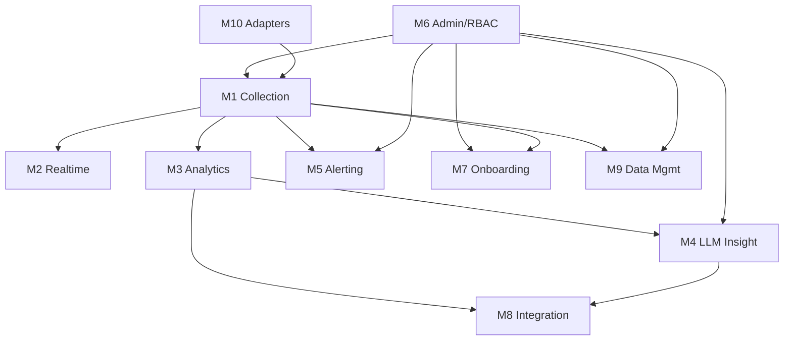

# Module List — AgentLens

> ⚠️ **Full-vision (đã hoãn).** Mô tả phạm vi org-wide 10 module ban đầu. Phạm vi hiện tại là **lean/local-first** — xem `PRD-0001` v5, `TRD-0001` v2, `DECISION-LOG.md` (D-12).

> System → Module breakdown. Drives feature-catalog + SA feature-spec. Nguồn: PRD-0001 §III.

| Module | Tên | Boundary / Mô tả | FR | Phụ thuộc | PRD § |
|---|---|---|---|---|---|
| **M1** | Collection | Thu hook (HTTP) + transcript JSONL + OTEL trên máy dev; chuẩn hóa event agent-agnostic; buffer/sync | FR-1..6 | — | §III/M1 |
| **M2** | Realtime Monitoring | Live timeline (gom prompt_id), event detail (tool/thinking), replay, multi-session | FR-7..11 | M1 | §III/M2 |
| **M3** | Analytics & Reporting | Dashboard token/cost/latency/deny, trends, filter, compare, breakdown, export, FinOps, tagging | FR-12..20 | M1 | §III/M3 |
| **M4** | LLM Insight (multi-provider) | Tóm tắt + đề xuất; LLM Gateway đa vendor; redaction; cost guardrail; anomaly; provider policy | FR-21..27, 48..50 | M1, M3, M6 | §III/M4 |
| **M5** | Alerting | Rule engine + anomaly → notify (in-app/email/Slack/webhook); policy theo team | FR-28..30 | M1, M6 | §III/M5 |
| **M6** | Admin, RBAC & Settings | SSO/OIDC + RBAC; settings (provider/retention/redaction); audit; org/team/project | FR-31..34 | — | §III/M6 |
| **M7** | Onboarding & Collector Mgmt | Wizard cài/cấu hình hook+OTEL; health collector; phân phối config (MDM) | FR-35..37 | M1, M6 | §III/M7 |
| **M8** | Integration (API/Webhook) | REST API đọc data/insight; webhook outbound; forward ELK/OTEL | FR-38..40 | M3, M4 | §III/M8 |
| **M9** | Data Management & Retention | Retention/purge; export/backup; xóa theo user/project | FR-41..43 | M1, M6 | §III/M9 |
| **M10** | Multi-agent Adapters | Adapter interface chuẩn + adapter Claude Code/Codex/Antigravity | FR-44..47 | M1 | §III/M10 |

## Sơ đồ phụ thuộc

## Owner đề xuất
M1/M10 → DEV core (Rust); M2/M3 → DEV UI + backend query; M4 → DEV + Security (redaction); M5 → DEV backend; M6 → Platform/Security; M7 → Platform; M8 → DEV; M9 → Platform/Security.

## Open questions
- M8 (Integration) và M7 (Onboarding) ưu tiên đến đâu so với M2/M3?
